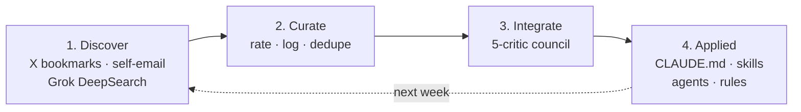

# Continuous Improvement

Tips arrive every day — X especially, but also blogs, newsletters, Slack, the occasional email from a friend who just discovered something. It's a firehose. The temptation is to drink from it. The result is churn.

Six questions I keep running into:

- Which tips are worth adopting?
- Where do I store them so they're not lost?
- How do I remember the ones I already filed?
- How do I prioritize what to actually integrate?
- How do I get a tip into my workflow, not just a notes file?
- How do I avoid wrecking a working setup with a bad addition?

This is the system I built for myself. It might work for you. You may want to adapt it. Either way, here it is.

It's a four-stage loop that runs weekly. Each stage is one skill; the loop closes itself.

1. **Discover** — pull tips from X bookmarks, forward articles to a self-email label, and run a [Grok DeepSearch](https://grok.com/) shaped by the gaps in your existing log.
2. **Curate** — rate each tip High / Medium / Low, append to a single growing log file, dedupe against history.
3. **Integrate** — five critics argue in parallel; the top three auto-apply to CLAUDE.md, skills, agents, or rules. The rest get filed for later.
4. **Applied** — the change lands in your config, the loop starts again, and your setup is slightly better than it was last week.



!!! warning "Manual, not automated."
    No cron, no hook. The pipeline runs when I run it (or when a backlog trips a nudge). `/tips-curate` is the only stage that reaches into the next: when more than 15 high-quality tips accumulate since the last integrate run, it offers to invoke `/tips-integrate` in the same session.

---

## A council, not a checklist

Stage 3 is where this loop differs from a typical "save tips and try them later" practice. One Claude rating its own tips is peer-reviewing your own paper. The model anchors on the framing of the tip and produces convergent praise. I tried that for a few months and ended up with a config full of plausible-sounding additions that didn't compound and weren't worth their maintenance.

The fix is structural disagreement. Five personas in parallel, each told to score from one specific lens and not balance — Maintenance Tax notices that a tip depends on a single-maintainer repo, Catalog Conflict notices it duplicates an existing rule, First-Run notices that the "obvious" first step actually requires three design decisions. The composite scores them; the user approves. The council ranks but does not gate.

The general pattern is a separate, reusable skill. [`/council`](https://github.com/chrisblattman/claudeblattman/blob/main/skills/council.md) dispatches a parallel panel of critics on any plan, draft, or decision — useful for stress-testing a research design, a grant proposal, or a hiring call. The tips pipeline uses a specialized version: five fixed personas, defined in [`proposal-critic-agent`](https://github.com/chrisblattman/claudeblattman/blob/main/agents/proposal-critic-agent.md) and tuned for evaluating workflow tips.

---

## Meet the five critics

| Critic | What it asks |
|---|---|
| **Catalog Conflict** | Does this fight something I already do? |
| **Maintenance Tax** | What will this cost me in six months? |
| **Compounder** | Does this make other skills better, or sit alone? |
| **First-Run** | Is the 30-minute first step concrete? |
| **Skeptic** | Real practitioner use, or engagement farming? |

Each persona scores every candidate tip 1–5 with a single-sentence rationale and a `BLOCKING: yes/no` flag. Five personas × N tips = a stack of structured opinions, not a vote.

!!! example "What one critic actually says"
    ```
    TIP: 2026-04-12::Use XML tags around few-shot examples
    PERSONA: Maintenance Tax
    SCORE: 4
    RATIONALE: XML tag conventions are documented Anthropic guidance
      and survive model upgrades; no third-party dependency to rot.
    BLOCKING: none
    ```

??? example "Composite scoring (for the curious)"
    From `/tips-integrate` v2.1, verbatim:

    ```
    composite = mean(5 persona scores) − 0.1 × blocker_count
    ```

    Additive penalty, not multiplicative — a tip with all five blockers retains most of its mean. The council ranks; the user gates. **Top 3 auto-apply** (each file write is still per-item confirm — you see the diff and can skip). **Items 4–7** get a single one-tap approval line. **Items 8–15** are surfaced with full council detail, never silently dismissed; you can promote any of them with `promote 10`.

    A minimum of 3 of 5 personas must return for the council to proceed; if the `proposal-critic-agent.md` file isn't installed, the skill falls back to single-critic mode and prints a one-line note.

---

<a id="example-from-email-to-proposal"></a>
## A tip's journey, end to end

The same tip the Maintenance Tax critic scored above, walked through the full loop:

=== "1. Discover"
    A blog post crosses my feed. I forward it to myself with `@toself` in the subject — works from my phone, my laptop, anywhere. Gmail tags it automatically.

    ```
    To: me
    Subject: @toself xml tags in skills
    Body: https://example.com/post — author shows that
    wrapping few-shot examples in <example>...</example>
    cuts misparses by ~30%.
    ```

=== "2. Curate"
    On Sunday, `/tips-curate` fetches every unread `@ToSelf` email, classifies each, fetches link content where it can, and rates the result High / Medium / Low. The approved entry lands in the [tips log](#the-tips-log):

    ```markdown
    ## 2026-04-12

    ### Use XML tags around few-shot examples [skill-design] [prompting] [high]
    - **Source:** [author] (Apr 11, 2026)
    - **Insight:** Wrap few-shot examples in <example> tags inside
      skill prompts — improves Claude's parsing of multi-example
      sections vs. plain text.
    - **Action:** Add an XML-tag convention to CLAUDE.md skill
      authoring rules; retrofit two highest-traffic skills.
    - **URL:** https://example.com/post
    ```

=== "3. Integrate"
    Two weeks later the high-tip backlog crosses 15. `/tips-curate` offers to invoke `/tips-integrate`. Five personas dispatch in parallel against the batch. The composite for this tip:

    ```
    Catalog Conflict:  4   (no existing rule on tag conventions)
    Maintenance Tax:   4   (Anthropic guidance, no rot)
    Compounder:        5   (lifts every skill that uses examples)
    First-Run:         5   (one CLAUDE.md line; clear retrofit list)
    Skeptic:           3   (one author, but evidence is concrete)

    composite = 4.2 − 0 = 4.2  →  rank #2  →  auto-apply band
    ```

=== "4. Applied"
    Top 3 auto-apply, with a per-item confirm on each file write. I see the diff:

    ```diff
     ## Skill authoring rules

    +- Wrap multi-example sections in <example>...</example> tags.
    +  Improves Claude's parsing reliability vs. plain prose.
     - Skills under 300 lines unless layered structure required.
    ```

    I press `y`. The change lands in CLAUDE.md. The state file records the integration so the same tip never resurfaces.

Investigation tasks (Type B — tips that need design work before any file change) take a different exit: instead of a direct edit, the council writes a one-line entry to your [learning catalog's INBOX](#the-learning-catalog) for triage at your own pace.

---

## What it has actually changed

A sample of recent council-approved edits from the log:

| Tip | Resulting change |
|---|---|
| Wrap few-shot examples in `<example>` tags | New rule line in CLAUDE.md skill-authoring section |
| Use action verbs over "be thorough" in depth-injection | Updated `prompt-preferences.md` depth tier table |
| Pre-flight glob for persona files before council dispatch | New rule in `agent-dispatch.md` |
| Cap context-management thresholds in absolute tokens (4.7 / 1M) | Rewrote `context-management.md` warning thresholds |

Most weeks produce one or two direct edits. Most of the council's output is *investigation tasks* — tips that need a design decision before any file change — which land in the learning catalog INBOX rather than the config.

!!! tip "First runs are mostly investigations, not edits."
    The council often defers tips into research tasks rather than rule changes. That's the system working — it's protecting your config from churn. Direct-edit volume rises as your setup grows and the skill has more concrete files to point at.

---

<a id="the-four-steps"></a>
## The four skills

### `/tips-bookmarks` — pull from the firehose

Pulls X/Twitter bookmarks via `twitter-cli`, classifies each, dedupes against the log, and appends new items. Replaces the manual copy-paste-email step that catches Twitter content via the curate path otherwise. [Public skill →](../setup/skill-reference.md#tips-bookmarks-x-bookmark-pull)

!!! tip "Or use the Gmail path"
    The pipeline works without `/tips-bookmarks`. `/tips-curate` already covers email-forwarded Twitter posts via the message body — Twitter URLs always fail under WebFetch, so the body text is what gets classified. `/tips-bookmarks` just removes the forwarding friction if you bookmark heavily on X. Pick whichever fits your habit.

### `/tips-scout` — seed a search worth running

Reads the last 14 days of the tips log and your active TODOs to find your *coverage gaps*, then customizes a base Grok DeepSearch prompt: BOOST categories you're under-covered on, DE-EMPHASIZE ones you're saturated on, inject your active investigation topics as bonus targets. The result is a paste-ready prompt that won't surface ground you already covered.

[Public skill →](../setup/skill-reference.md#tips-scout-search-prompt-generator)

### `/tips-curate` — rate and file

Fetches unread `@ToSelf` emails in batches of five, classifies each (`worth-reviewing` / `not-relevant` / `needs-manual`), fetches link content where it can, rates High / Medium / Low against four quality questions, and appends approved items to `collected-tips-log.md`. Marks emails read but leaves `needs-manual` items unread so they stay visible.

The v1.5 backlog nudge fires at the end of every run: if more than 15 HIGH tips have accumulated since the last `/tips-integrate`, the skill offers to invoke it in the same session. Replaces a standing biweekly calendar ritual that fired with empty queues some weeks and sat dormant during high-flow weeks.

[Public skill →](../setup/skill-reference.md#tips-curate-tip-curation)

### `/tips-integrate` — convene the council

Six phases: pre-checks, scan sources since `last_run`, **the council (Phase 1.5)**, generate proposals on the top 7, auto-apply / approve / surface, then log. Each council persona is a parallel `Task` dispatch to `proposal-critic-agent` with a different persona injected — five Sonnet runs at ~35K tokens each.

Single-critic fallback runs automatically if `proposal-critic-agent.md` isn't installed in `~/.claude/agents/`. The council was added in v2.1 because single-critic ranking under-weighted maintenance tails — surface-appealing tips kept getting auto-proposed despite obvious six-month rot.

[Public skill →](../setup/skill-reference.md#tips-integrate-tip-integration) · [Council agent →](https://github.com/chrisblattman/claudeblattman/blob/main/agents/proposal-critic-agent.md)

---

## Setup

You need [Gmail MCP configured](../toolkit/mcp-setup.md) and a Gmail label called `@ToSelf`:

1. In Gmail → left sidebar → **+ Create new label** → name it `@ToSelf`
2. Optional filter: search bar filter icon → **Subject:** `@toself` → **Create filter** → **Apply label:** `@ToSelf`

Now any email with `@toself` in the subject gets tagged automatically. Forward interesting articles, email yourself quick notes, or manually label anything you want processed later. Works from any device.

---

## When to run

| Skill | Frequency | Trigger |
|-------|-----------|---------|
| `/tips-scout` | Weekly | Before `/tips-curate`, to generate a search prompt |
| `/tips-curate` | Weekly | When you have unread @ToSelf emails |
| `/tips-integrate` | Opportunistic | When `/tips-curate` flags >15 HIGH-quality tips since last run |

No rigid schedule. The integrate skill warns you if tips are stale.

---

## Install

Minimum-viable adoption, in order:

1. Install [`/tips-curate`](../setup/skill-reference.md#tips-curate-tip-curation) and [`/tips-integrate`](../setup/skill-reference.md#tips-integrate-tip-integration) from the [Skill Library](../setup/skill-reference.md). `/tips-scout` is the upstream feeder — add it once curate is working.
2. Copy `proposal-critic-agent.md` to `~/.claude/agents/`. Without it, `/tips-integrate` runs single-critic; the council needs the agent file present.

    ```bash
    curl -o ~/.claude/agents/proposal-critic-agent.md \
      https://raw.githubusercontent.com/chrisblattman/claudeblattman/main/agents/proposal-critic-agent.md
    ```

3. Create the `@ToSelf` Gmail label per the [Setup](#setup) section above.
4. Run `/tips-curate dryrun` first to see classifications without writing anything. Then a real `/tips-curate`. Don't run `/tips-integrate` until you have at least a dozen High tips logged — the council needs material to rank.

??? tip "Adapt to your setup before first run"
    The public skill files use generic paths like `~/.claude-assistant/tips/` and `~/.claude-assistant/catalog/`. Search each file for these paths and update them to match your directory structure. Also check the Gmail label name in `/tips-curate` — the default is `@ToSelf`.

    On first run, expect mostly Type B (investigation) proposals. Type A (direct edit) proposals only fire when the skill finds matching config files in your setup. As your system grows, so do the direct edit targets.

---

## The tips log

The curate step writes approved tips to a dated, tagged markdown file that grows over time. Each entry records what you found, where it came from, and what to do about it. The [worked journey above](#a-tips-journey-end-to-end) shows the exact format — date, tags like `[prompting]` or `[skill-design]`, source link, insight, and a concrete next action.

After six months mine had 85+ entries. You don't need to remember what you read last month — search the log by keyword or tag, or point Claude at it and ask "what do I have on agent patterns?" The log becomes institutional memory that survives across sessions.

Browse a [snapshot of my actual tips log](../downloads/collected-tips-log.md) to see what this looks like at scale.

---

## The learning catalog

The tips log captures discoveries. The learning catalog captures *decisions* — what's worth doing, what you've tried, what you've dismissed.

When `/tips-integrate` flags a tip as needing research before action (Type B), it lands in the catalog's **INBOX** section. You review periodically and promote each item to a tier:

| Tier | Meaning |
|------|---------|
| **HIGH** | Clear payoff, do soon |
| **MEDIUM** | Worth evaluating, not urgent |
| **LOW** | Not worth pursuing now; kept for reference |
| **DONE** | Implemented and working |
| **REJECTED** | Assessed and dismissed; won't resurface |

Items always enter via INBOX — the skill doesn't make priority calls on your behalf.

Each HIGH and MEDIUM entry carries plain-English context: *what it is*, *why it matters for you*, and *next step*. The format is designed for future-you who's forgotten the original tip. A DONE entry looks like:

| Item | Was | Completed |
|------|-----|-----------|
| arjunkmrm/recall | Cross-session search — `/recall` searches 1,918 past conversations by keyword | Mar 3, 2026 |

DONE and REJECTED entries are never deleted — they prevent you from re-evaluating the same thing six months later.

---

## Browse real examples

The kinds of workflows and resources the pipeline is designed to capture and evaluate. Worth browsing to see what's out there:

- **[Boris Tane: How I Use Claude Code](https://boristane.com/blog/how-i-use-claude-code/)** — The research-annotate-implement workflow. One of the highest-rated tips in my log.
- **[Anthropic's Official Skills Library](https://github.com/anthropics/skills)** — Anthropic's own example skills, including a document plugin for PDFs and spreadsheets.
- **[Awesome Claude Skills](https://github.com/travisvn/awesome-claude-skills)** — Community-curated list of skills, patterns, and tools. Good scouting territory.
- **[Anthropic Skills Cookbooks](https://github.com/anthropics/claude-cookbooks/blob/main/skills/README.md)** — Tutorial notebooks for building custom skills from scratch.

---

## Customization

**`/tips-curate`:** Tips log location, Gmail label name, batch size, quality thresholds — all configurable by editing the skill file directly.

**`/tips-integrate`:** Source selection, state file location, target config files, pruning intervals — same approach, edit the markdown.

---

!!! tip "The other input channel: your own corrections"
    This pipeline is *proactive* — scheduled discovery. Your system also learns *reactively*: when you override a classification, substantially edit a draft, or manually do something a skill should handle, a self-improvement protocol proposes targeted config changes on the spot. Scheduled scouting from outside, continuous feedback from inside.

---

## See also

- **[Collected Tips & Research Log](../downloads/collected-tips-log.md)** — A snapshot of my own tips log. Searchable by keyword, tag, or date.
- **[`/council`](https://github.com/chrisblattman/claudeblattman/blob/main/skills/council.md)** — the general-purpose council skill, for plans, drafts, and decisions outside the tips pipeline.
- **[The proposal-critic agent](https://github.com/chrisblattman/claudeblattman/blob/main/agents/proposal-critic-agent.md)** — full persona definitions.
- **[`/review-plan` — Stress-Test Any Plan](../workflows/plan-review-browser.md)** — Pairs well with the pipeline: curate ideas, then review plans before implementing.
- **[Skill Design Patterns](../downloads/skill-patterns.md)** — How production skills are structured, if you want to build your own.
- **[Building skills](building-skills.md)** — Patterns the council looks for when scoring "Compounder".
