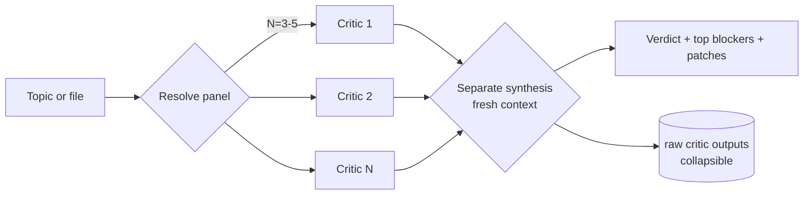

# /council — Parallel Critics, Separate Synthesis

`/council` is inspired by — but adapted from — Andrej Karpathy's [LLM Council](https://github.com/karpathy/llm-council) idea: ask several models the same question in parallel, then have one separate pass read their answers as data. I borrowed the shape and changed two things. Karpathy's council is cross-model by default; mine is cross-*role* by default (editor, referee, methodologist, skeptic), with one optional cross-vendor seat for Codex or Gemini. And I forbid debate. Single round, no rebuttals, no majority vote on narrative output — the 2025 conformity-drift literature convinced me round-two was not worth the cost.

The mechanic: parallel dispatch of up to five critics, each with one lens and explicitly told not to balance. A separate model run, with no memory of the critique conversation, reads the raw outputs as input data and ships a verdict plus a punch list. That separation is what stops the council from collapsing into the kind of hedged consensus you get from a single chat thread. I learned this watching a single fresh-context agent rubber-stamp a grant aim that a real referee tore apart two weeks later.

For the longer lineage — Tree of Thoughts, eval-juries, Debate — see [Lineage and contribution](#lineage-and-contribution) below.

---

## When to reach for it

| Trigger | Why a council |
|---|---|
| **Grant proposal** | Five lenses (editor + referee + methodologist + grant strategist + funder officer) catch what one of them alone would miss |
| **Hiring call** | Pre-mortem + skeptic + chief-of-staff working in parallel surface failure modes one reviewer rationalizes away |
| **Architecture decision** | Skills engineer + skeptic + budget hawk + pre-mortem disagree on what counts as the real cost |
| **Paper / draft** | Academic editor + harsh referee + methodologist run the same review three editors would, in three minutes |
| **Skill or tool design** | Skill engineer + UX-for-tools + non-expert adoption — see chef-skill mode below |

I reach for `/council` on the third revision of something high-stakes, not the first. Earlier in the loop, the [`/prompt`, plan, `/review-plan`, `/done`](first-session-skills.md) cycle does the work for less.

---

## Quick start — chef-skill mode (no setup)

The version that works out of the box, with no persona files installed, is `--chef-skill`:

```
/council --chef-skill <topic or file:path>
```

This dispatches a hardcoded three-role panel — skill engineer, UX-for-tools critic, non-expert adoption critic — useful for reviewing a skill, slash command, MCP tool, or CLI workflow. Each role is implemented as an inline prompt to a generic agent, not as a persona file. Nothing to install. If you want to feel the pattern before committing to a persona library, start here.

For broader use — plans, papers, decisions, grants — keep reading. Those panels need persona agent files in `~/.claude/agents/`, and the council aborts cleanly if any are missing rather than silently substituting a worse critic.

---

## How it works



Each critic sees the same input. None see each other's output. The synthesis pass is a new model run that reads the raw critique as data — it does not inherit the conversation history that produced any single critic's reasoning. That's the part that matters.

---

## The four default panels

| Panel | Critics | When |
|---|---|---|
| **Plan** | skills-engineer + skeptic + pre-mortem + budget-hawk | Architecture decisions, project plans, anything reversible-but-expensive |
| **Paper** | academic-editor + harsh-referee + methodologist | Manuscript review, before submission |
| **Grant** | academic-editor + harsh-referee + methodologist + grant-strategist + funder-officer | Full proposal review at the five-critic cap |
| **Decision** | skeptic + pre-mortem + chief-of-staff | Go/no-go calls, hiring, accept/reject |

Pick one with `--type plan` (or paper / grant / decision). Or let keyword inference resolve from the topic ("plan", "manuscript", "grant", "should I" → respective panels). Override with `--panel a,b,c` for a custom roster. Cap is five.

---

## A council in action

A real-feeling example. The topic: an Aim 2 paragraph in a grant proposal claiming that a community-policing intervention will reduce homicides in three Latin American cities.

Panel resolved: `--type grant` → academic-editor + harsh-referee + methodologist + grant-strategist + funder-officer.

The critics, dispatched in parallel and shown verbatim in the synthesis output:

- **Academic editor** — *the claim sentence stacks four hedges. "May plausibly contribute to" carries no information. Cut to one of: "We expect to detect" or "We will test whether."*
- **Harsh referee** — *the identification strategy reads as RDD on policing-density gradients but the manuscript never names it. Either commit and defend the running variable, or downgrade the contribution claim.*
- **Methodologist** — *attrition risk is unmodeled. Three-city pooled estimate hides heterogeneity that, given the small N of cities, will dominate the standard errors. Show the per-city cuts.*
- **Grant strategist** — *Aim 2 over-promises relative to budget. The funder will read this as "$2M to detect a 15% homicide drop in three cities," and the methodology section will not survive that read.*
- **Funder officer** — *Would I fund? Conditionally. The contribution language is too soft for the stage. The methodology is fundable; the claim is not.*

Synthesis (separate model, fresh context): **REVISE.** Top three patches: rewrite the contribution claim to commit; name the identification strategy in the methods preview; drop pooled-estimate language in favor of per-city expected effects.

That's the ship — five critics, one verdict, and a punch list.

---

## The rules that make it work

These are not stylistic preferences. Each one is load-bearing.

- **Hard cap of five critics.** Beyond five, the synthesis gets noisier, not richer. The 2024–2025 multi-agent literature on diminishing returns is consistent on this.
- **Single round only.** No iterative debate. Round-two-and-beyond debate among critics drifts toward conformity — well-documented in the 2025 conformity-drift papers.
- **No majority vote on narrative.** The synthesis ranks but does not vote. A unanimous panel can still be wrong; a 1-of-5 dissent on the right point is more valuable than four agreements on the wrong frame.
- **Separate synthesis dispatch.** The synthesis runs in a fresh context. It reads the raw critic outputs as input data — not as the tail of a conversation it was part of.
- **Persona files exist before dispatch.** No silent fallback to a generic agent. If a panel calls for `harsh-referee` and you don't have `harsh-referee-agent.md` installed, the council aborts and tells you which file is missing. Better to fail loudly than to substitute a worse critic without telling you.

---

## When to add a peer critic

A council of five Claudes still shares one model's blind spots. The fix is to swap one seat for Codex or Gemini — same prompt, different vendor, dispatched in the same parallel call. I have caught failures this way that no all-Claude panel surfaced, mostly around empirical claims Claude wanted to believe.

Setup, flags, the worked mixed-vendor example, and the manual paste-loop for tools without CLIs (Grok, ChatGPT Deep Research, Perplexity) live on the [AI integration](../system/ai-integration.md) page.

---

## Lineage and contribution

Andrej Karpathy gave the pattern its handle in his "LLM councils" note: parallel critics, separate synthesis, no debate. The lineage is older. The structural shape — multiple draws, evaluate the spread — is the same one Yao et al. (Tree of Thoughts, 2023) used inside a single model's reasoning, and the same one Anthropic's eval-jury work uses for benchmarking. OpenAI's "AI Safety via Debate" sits as the deliberate contrast: I do not allow debate, because the 2025 multi-agent literature on conformity drift convinced me single-round was not negotiable.

My contribution is two narrower things. First, a fixed-persona spin-up — the [five-critic tips council](../system/continuous-improvement.md), with each persona tuned for one failure mode (catalog conflict, maintenance tax, compounder, first-run, skeptic) and explicitly told not to balance. Second, the cross-vendor swap: one seat goes to Codex or Gemini, dispatched in the same parallel call. Both ship as code, not as theory.

---

## Install and setup

The fastest path: tell Claude Code to install it for you. Paste this into a Claude Code session:

```
Install /council from https://github.com/chrisblattman/claudeblattman.
Copy skills/council.md to ~/.claude/commands/council.md and copy
agents/proposal-critic-agent.md to ~/.claude/agents/. Create the
directories if they don't exist. Then list what you installed.
```

Claude will fetch the files, drop them in place, and report back. Restart Claude Code and `/council` is live.

What you get out of the box:

1. **Chef-skill mode** — works immediately. `/council --chef-skill <topic>` runs a hardcoded three-role panel for skill, tool, or workflow review. No persona files needed.
2. **Default panels** (plan / paper / grant / decision) — the install above includes one persona, `proposal-critic-agent`, used by the [tips council](../system/continuous-improvement.md). For wider panels (skeptic, pre-mortem, methodologist, harsh-referee, etc.), build the agents as you need them. The skill aborts cleanly if a panel calls for a missing file — no silent fallback to a worse critic.
3. **Mixed-vendor mode** — install Codex (macOS app) or Gemini (`npm install -g @google/gemini-cli`) to swap one seat. Optional. The skill degrades gracefully if a peer binary is missing.

Prefer manual install or want individual `curl` commands for each file? See the [skill reference](../setup/skill-reference.md).

---

## See also

- **[Deep Research](deep-research.md)** — the gather-and-synthesize workflow that produces the kind of input most worth running a council on.
- **[Continuous Improvement](../system/continuous-improvement.md)** — the worked tips-pipeline specialization where five fixed personas (catalog conflict, maintenance tax, compounder, first-run, skeptic) decide what enters my CLAUDE.md. The general pattern, applied to one specific domain.
- **[AI integration](../system/ai-integration.md)** — cross-vendor critics (Codex, Gemini) as council members; setup, flags, manual paste-loop for tools without CLIs.
- **[`/review-plan`](plan-review-browser.md)** — the browser-side single-pass version, useful before you reach for a five-critic council.
- **[Prompt, plan, review, revise](first-session-skills.md)** — where `/council` fits in the broader loop.
