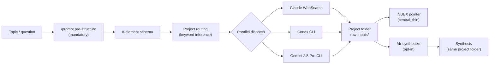

# Deep Research — Federated, Multi-Vendor, Synthesizable

I used to dump research outputs into one folder and never look at them again. Now the report lives in the project folder it was built for, three vendors run the same prompt in parallel, and a separate synthesis pass tells me where they disagreed. The bones came from one observation: a single model on a research question is one critic's blind spot at scale.

This page is the end-to-end workflow — how `/deep-research` builds the prompt, dispatches Claude WebSearch + Codex + Gemini in one parallel call, files each report next to the project it belongs to, and how `/dr-synthesize` reads the raw outputs as data and ships the agreements, contradictions, and gaps. The browser-only tools (ChatGPT Deep Research, Grok, Perplexity) fold in through a paste-loop. Council pattern shows up as a dependency, not the headline.

---

## Why this is its own workflow

Deep research is gather + synthesize. [`/council`](council.md) is critique. They share the parallel-dispatch shape, but the inputs, outputs, and failure modes are different.

- A council reads one artifact you already have and returns critique on it. The output is a verdict and a punch list. The input is finished.
- Deep research starts with a question and ends with three reports plus a synthesis that names where the reports agreed and where they didn't. The output is a corpus you can cite. The input is a topic.

The mistakes are different too. A council fails when critics drift toward consensus or when the panel is wrong for the task. Deep research fails when reports get filed in a central pile nobody reads, or when two vendors disagree and you only read one, or when "I'll synthesize later" never happens. This page exists because those failure modes deserve their own engineering.

---

## The three problems it solves

**One model has its own blind spots.** The same question routed to Claude alone gets you Claude's distribution. Three vendors in parallel — Claude WebSearch, Codex, Gemini Pro — surface the same answer when they agree (high signal) and surface a real disagreement when they don't (also high signal). Disagreement is where the work is. I have caught more useful contradictions on grant aims and lit reviews from a three-vendor pass than from any solo Claude run, and the marginal cost is one Bash dispatch.

**Reports get lost in a central archive.** I had a `~/research-archive/` folder for two years. I almost never opened it. Reports written for Project A sat next to reports written for Project B, and when I returned to Project A six weeks later, I forgot the report existed. The mechanism is mundane — out of sight, out of grep range, out of working memory. The fix is to file the report inside the project folder it was built for, alongside the prompt that produced it. The central archive holds only an INDEX pointer per report — small enough to grep, light enough to actually use, and the natural place to start when you can't remember which project something belonged to.

**Two reports that disagree means reading both.** Without a synthesis pass, you either skim and miss the contradictions, or you read both and lose an hour. Both failure modes are common; neither is acceptable on a grant aim. `/dr-synthesize` reads the raw reports as data and writes a single file: agreements, contradictions, gaps, unique-per-source. That file lives in the same project folder as the inputs and points back to them by absolute path. The raw reports are still there if you want them. Most of the time you only need the synthesis.

---

## The shape of a run



Three vendors. Same prompt. Reports land in the project folder. INDEX gets a one-line pointer. Synthesis is opt-in but a single flag away.

The order is deliberate. Pre-structure before routing because a routing decision based on a malformed topic gets you a malformed file. Routing before dispatch because reports without a destination accumulate in `/tmp` and disappear. Synthesis last because synthesizing reports that haven't finished writing produces a hallucinated synthesis pointing to files that don't exist.

---

## Step 1 — Pre-structure the prompt

Every `/deep-research` invocation runs `/prompt` first. No exceptions, no inference of "this prompt is good enough to skip." The only override is the explicit `--no-prestructure` flag.

The reason is mechanical: even tight questions hide implicit audience, scope, and output shape. `/prompt` surfaces them. Five to fifteen seconds of restructuring buys a substantially better dispatch — research-grade prompts pay rent on every downstream vendor. The pre-structure pass shows you the formatted version with a `[y/N/edit]` gate before any vendor sees it. If the restructure is wrong, you edit it once and it's wrong on zero vendors instead of three.

The 8-element schema (deep tier) builds on top of that:

1. **Task** — imperative, what's being researched and what shape the answer takes.
2. **Scope boundaries** — time window, geography, source-type. Cuts off rabbit holes early.
3. **Evidence constraints** — citation depth, primary-source requirement, recency floor.
4. **Output structure** — headings, length caps, schema. Forces commitment to a shape before the model starts writing.
5. **Success + anti-goals** — what good looks like and what to avoid. Anti-goals catch the "literature-review-style overview" failure mode that vendors default to.
6. **Comparative anchoring** *(deep only)* — force comparison to a known reference. Models default to standalone description; this forces relative judgment.
7. **Self-verification** *(deep only)* — ask the model to audit its own output against a checklist before delivering. Catches hallucinated citations and missing scope.
8. **Tool trigger** — explicit "use DeepSearch / search live sources / cite by URL." Without this, vendors revert to training-data answers.

The standard tier (`--depth standard`) drops elements 6 and 7 for cheaper runs. The schema is also documented in the [skill reference](../setup/skill-reference.md).

---

## Step 2 — Dispatch in parallel

Default is `--tool both`: Claude WebSearch + Codex, in one parallel call. `--tool all-auto` adds Gemini for the three-vendor pass. `--tool claude` is the cheap mode (also reachable via `--quick`, which combines `--tool claude --depth standard`).

The dispatch is one Claude Code message with concurrent tool calls — one Task spawn for the Claude subagent, one Bash for Codex, one Bash for Gemini if you're running all three. No `&` + `wait`, no shell-level parallelism. The harness handles concurrency cleanly; manual backgrounding has been a source of fragile error propagation in earlier versions.

What each vendor brings:

- **Claude WebSearch** — judgment on quality of evidence, willing to say "the literature is thin here." Best when the question hinges on weighing trade-offs.
- **Codex** — sharper on empirical and engineering claims. Catches the kind of unsupported assertion Claude wants to believe. Spawned via the Codex CLI bundled with the Codex desktop app on macOS.
- **Gemini 2.5 Pro** — long-context, search-grounded. Best on coverage — "did we miss anything." The OAuth default is the lighter Flash-Lite, which is a different critic. Always pin Pro with `-m gemini-2.5-pro`. The skill pins it for you; the warning is here in case you ever drive Gemini outside the skill.

Codex has a per-machine quota (5-hour rolling window). Phase 2 of the dispatch checks `ccusage` before firing the Codex arm. If you're above 85% of the bucket, the arm blocks and the skill suggests `--tool claude` or `--force`. Below that, it proceeds silently. The Claude arm is the fallback either way — Codex is a bonus, not a dependency.

Paste-loop tools — ChatGPT Deep Research, Grok DeepSearch, Perplexity, Gemini Deep Research (browser) — are opt-in only. The skill never volunteers them as bonus arms, because architecturally Claude Code cannot pause a Bash call to wait for a paste. Splitting into a separate `--absorb` invocation is the only reliable design. They live in [Step 4](#step-4-absorb-browser-outputs).

For Codex and Gemini CLI install, see the [AI integration page](../system/ai-integration.md). It is the canonical source; this page does not duplicate it.

---

## Step 3 — Federated archive

This is the differentiator. The report does not go into one central pile. It goes into the project folder it was built for.

```
~/projects/my-grant/raw-inputs/
  2026-04-25_homicide-low-trust_prompt.md
  2026-04-25_homicide-low-trust_claude.md
  2026-04-25_homicide-low-trust_codex.md
  2026-04-25_homicide-low-trust_gemini.md
  2026-04-25_homicide-low-trust_synthesis.md
```

The central archive holds only `INDEX.md` and `INDEX.jsonl` — pointer rows, one per report, with date, topic, tool, project, and path. The whole archive directory should stay under a megabyte indefinitely. If it grows past that, content has leaked into the pointer dir and the federation has broken down.

Routing is by keyword inference against `~/.claude-assistant/config/deep-research-routing.json`. The config maps project keys to a folder path plus `title_patterns` (substrings that imply that project) and optional `exclude_patterns`. If the topic matches one project, the skill confirms before filing. If it matches several, you pick. If nothing matches, the skill asks where to file rather than silently dumping into a `working-notes` catch-all. Silent fallback is how reports end up in folders nobody opens; the explicit prompt costs three seconds and prevents that class of drift.

The cross-project discovery story: open `INDEX.md`, grep for any topic word, click the path. The report is at the project, not in a quarantine you forgot about. The JSONL companion (`INDEX.jsonl`) is there for programmatic queries — `jq 'select(.project=="my-grant")'` returns every report filed against a project, in seconds.

Why this beats the central archive I had before: I actually read the reports now. The federation makes them findable from the place I'm already working. The central index makes them findable from anywhere else. One report, two access paths, neither of which depends on me remembering where I filed it.

---

## Step 4 — Absorb browser outputs

Some research tools don't have CLIs I trust. ChatGPT Deep Research, Grok DeepSearch, Perplexity, and Gemini's browser Deep Research live in the browser. The pattern for these is `--absorb`.

```
/deep-research --absorb
```

The skill scans every project's `raw-inputs/` folder for `.md` files lacking canonical frontmatter, previews each, asks for the source tool, renames to the canonical pattern (`YYYY-MM-DD_<slug>_<tool>.md`), prepends frontmatter, and adds an INDEX row. ChatGPT exports get a PUA-character cleaning pass automatically.

The drag-drop UX is what makes this fast. In your editor's file explorer, drop the `.md` into the project folder, then run `/deep-research --absorb` in the integrated terminal. No intermediate inbox, no orphan files in `~/Downloads`. Tool inference reads the file: PUA characters mean ChatGPT, a "Powered by Sonar" footer means Perplexity, an xAI/Grok header means Grok. If inference fails, the skill asks once.

Single-file path: `/deep-research --absorb /path/to/report.md --project my-grant`. Add `--synthesize` to chain straight into `/dr-synthesize` once the absorb completes — useful when the browser report is the third arm of a run that already has Claude and Codex outputs filed.

Why two invocations rather than one waiting Bash call: Claude Code cannot pause a Bash call mid-execution to wait for a user paste. The architectural fact is hard, and pretending otherwise produces flaky workflows that hang or time out. Splitting into "emit the prompt and exit" + "absorb when you have the result" is the simplest reliable design and matches how I actually use browser tools — the prompt goes out, I switch to the browser, the report comes back when it comes back.

---

## Step 5 — Synthesize with /dr-synthesize

A pile of three reports is not a synthesis. It's a pile.

```
/dr-synthesize \
  ~/projects/my-grant/raw-inputs/2026-04-25_homicide-low-trust_claude.md \
  ~/projects/my-grant/raw-inputs/2026-04-25_homicide-low-trust_codex.md \
  ~/projects/my-grant/raw-inputs/2026-04-25_homicide-low-trust_gemini.md
```

Or, if you want it to fire automatically after dispatch:

```
/deep-research "<topic>" --tool all-auto --synthesize
```

The synthesis pass reads each input report, identifies overlap and divergence, and writes a new file. It does not re-do the research. It reads the research as data.

Output sections, fixed schema:

- **Source Reports** — absolute paths to every input. Mandatory. First section. If a path no longer exists at synthesis time, the skill fails loud rather than silently dropping a source.
- **Headline Findings** — what every source agreed on, or the most important emergent insight.
- **Agreements** — where sources converge, citing which.
- **Contradictions** — where sources disagree, citing which said what. The skill does not pick a winner unless evidence is one-sided.
- **Gaps & Open Questions** — what no source addressed.
- **Unique Per-Source Insights** — what only one tool surfaced, organized by tool.

Synthesis is always a new file. Raw inputs are never edited. The synthesis lives in the same project folder as its sources, and INDEX gets a `synthesis` pointer row tagged `tool: synthesis` so you can filter for synthesized vs. raw outputs in the JSONL.

A note on the **Source Reports** header: it is mandatory, it goes first, and the paths are absolute. This is what stops the synthesis from becoming a free-floating document with no provenance. If somebody (you, in three weeks) reads the synthesis and wants to know what evidence it leans on, the answer is the first thing in the file.

---

## A worked example — homicide reduction in low-trust cities

Say the question is what works to reduce homicide in low-trust urban settings — material I'd want for a grant aim, not for a finished paper. Thirty-source range. The dispatch:

```
/deep-research "What does post-2018 evidence say about reducing homicide in low-trust Latin American cities? Focus on identification strategy and external validity." --tool all-auto --synthesize
```

`/prompt` pre-structures, the 8-element schema fires, three vendors run in parallel. Forty minutes later — closer to fifteen if Codex is fast and Gemini doesn't get throttled — there are three raw reports plus a synthesis in `~/projects/homicide-grant/raw-inputs/`. INDEX gets four pointer rows: one per report plus the synthesis.

The synthesis section that earns its keep is **Contradictions**. Claude and Codex both lean on Bogotá hot-spots evidence and treat the result as well-replicated. Gemini, reading the broader corpus, flags that several of the cited follow-ups are downstream of one original Bogotá experiment — the "consistent evidence" is thinner than two of the three reports made it sound. Gemini also surfaces a 2024 São Paulo replication that returned a null and was missed by both Claude critics; that single paper would have been embarrassing to omit from a grant aim. And the three reports reach for different identification strategies on similar data — one leans on a regression-discontinuity design on policing-density gradients, another on synthetic control, a third treats the question as a pre/post comparison — which the synthesis records side by side rather than papering over with a single preferred reading.

The **Gaps** section in the same synthesis flags that no source addressed long-run effects beyond 24 months, which means the grant aim cannot honestly claim durability without a separate evidence base. That's a finding the synthesis surfaces precisely because three vendors all missed the same thing — convergent absence is its own signal.

That's the gather-and-synthesize beat. The synthesis sits in the project folder, ready for whatever I want to do with it next.

!!! tip "Illustrative, not a transcript"
    The contradictions above are drawn from the kinds of failure modes mixed-vendor deep research surfaces in real runs — not a single specific transcript. Use it as a pattern.

What I do *next* with the synthesis — if the stakes warrant — is the [next section](#when-to-also-run-a-council). The council critique on this synthesis is on the [AI integration](../system/ai-integration.md) page. Two pages, two beats of the same workflow.

---

## When to also run a council

Synthesis is not critique. The synthesis tells you where three reports agreed, disagreed, and missed things. It does not tell you whether the synthesis itself stands up to a harsh referee.

For grant aims, draft methods sections, or anything I plan to send to a co-author, I run `/council --type paper` on the synthesis after `/dr-synthesize` finishes. The council reads the synthesis as one input and returns a verdict plus a punch list — the same shape as any other council pass. Different beat, same loop. The synthesis answered "what do three vendors think." The council answers "does the synthesis hold up to a harsh referee."

The two patterns share parallelism but solve different problems. Deep research is about coverage — the cost of missing a paper or a contradiction. Council is about rigor — the cost of shipping something a referee will tear apart. You can run either alone. Running both, in that order, is the version I reach for when the artifact is going somewhere I can't easily walk it back.

There's a third combination — running a cross-vendor council on the synthesis itself, swapping one Claude critic for Codex or Gemini. That sits on the [AI integration page](../system/ai-integration.md) because the install and the directionality rules belong there. Mentioned here for completeness; not duplicated.

The bridge is one command:

```
/council --type paper ~/projects/homicide-grant/raw-inputs/2026-04-25_homicide-low-trust_synthesis.md
```

For the cross-vendor council variant — swap one Claude critic for Codex or Gemini on the synthesis — see the worked example on the [AI integration](../system/ai-integration.md) page. That's where this workflow connects to the council pattern in [council.md](council.md).

---

## Failure modes

The pattern is sturdy in the steady state but has a handful of predictable failure modes. Most of them are not bugs in the skill — they're consequences of running a multi-vendor parallel dispatch on top of tools that have independent quotas, auth states, and CLI quirks.

What goes wrong, in order of likelihood:

- **Vendor outage.** Codex or Gemini hangs or returns a non-zero exit. The skill's hard exit-code gate (Phase 3.5) marks the arm as failed and the synthesis includes only the surviving arms. You get a partial, not a hang. The stderr is captured in `/tmp/dr-<tool>-<run-id>.stderr` if you want to know what went wrong; most of the time it's an expired OAuth token or a transient network blip.
- **Paste-loop drift.** You run a browser tool, intend to absorb the result, and never do. The orphan `.md` sits in `~/Downloads` until you forget what it was. Mitigation: drop the file into `raw-inputs/` immediately, then `--absorb` in the same session.
- **Synthesis pointing to a path that no longer exists.** Reports get moved or renamed; the synthesis's `## Source Reports` paths go stale. `/dr-synthesize` fails loud on missing paths rather than dropping them silently. Re-run with corrected paths.
- **Stale routing config.** A new project gets created, the routing JSON doesn't, every dispatch falls into "no project match" and you start clicking through the manual pick. Easy to ignore for a month. Fix: edit `~/.claude-assistant/config/deep-research-routing.json` when you start a project, not when you remember the third time the prompt fires.
- **"I'll synthesize later" trap.** Three raw reports, no synthesis, six weeks pass. The reports are still there but you're not going to read three of them. The deferred-synthesis tax compounds: the longer you wait, the less you remember about which arm said what, the lower the marginal value of synthesizing at all. Mitigation: pass `--synthesize` on the original dispatch when you know you'll want a unified view, which is most of the time. The five extra minutes at run time are worth it; the five extra minutes six weeks from now are not.
- **Gemini OAuth model drift.** OAuth defaults to Flash-Lite. If you ever drive Gemini outside the skill, pin Pro with `-m gemini-2.5-pro` or you silently get the weaker critic.
- **Codex permission prompts.** First-time Codex dispatch from Claude Code can hit a sandbox heuristic that blocks the binary call even with `Bash(*)` allowed. Fix is one entry in `~/.claude/settings.json` per the [AI integration page](../system/ai-integration.md). Failing once is the cost; after the entry is in place, dispatch is silent.

---

## Install and setup

The fastest path: tell Claude Code to install it for you. Paste this into a Claude Code session:

```
Install /deep-research and /dr-synthesize from
https://github.com/chrisblattman/claudeblattman. Copy
skills/deep-research.md and skills/dr-synthesize.md to
~/.claude/commands/. Copy skills/deep-research-references/
to ~/.claude/references/deep-research/. Create the
directories if they don't exist. Then list what you installed.
```

What you also need:

1. **Claude Code itself.** Standard install. The Claude WebSearch arm uses the built-in subagent — no extra configuration.
2. **Codex CLI.** Bundled with the Codex desktop app on macOS. See the [AI integration page](../system/ai-integration.md) for setup, sandbox flags, and the permission-prompt fix that's required before the first dispatch.
3. **Gemini CLI.** `npm install -g @google/gemini-cli`, then OAuth. Same page covers Pro-model pinning and the OAuth quota.
4. **Routing config.** Create `~/.claude-assistant/config/deep-research-routing.json` with your project keys and `title_patterns`. The skill works without it — keyword inference falls back to prompting — but the inference loop is much faster with one. Minimal shape:

    ```json
    {
      "routes": {
        "homicide-grant": {
          "path": "~/projects/homicide-grant/raw-inputs/",
          "title_patterns": ["homicide", "policing", "crime"]
        },
        "working-notes": {
          "path": "~/projects/working-notes/raw-inputs/",
          "title_patterns": []
        }
      }
    }
    ```

    Add a route per project as you start them. The catch-all `working-notes` is for exploratory or meta research that doesn't belong to a specific project.

For individual `curl` commands or manual install, see the [skill reference](../setup/skill-reference.md). Do not duplicate Codex/Gemini install steps from this page; they live on AI integration.

---

A note on cost: the default `--tool both` (Claude + Codex) is roughly the cost of two Sonnet-class queries plus search. Adding Gemini as a third arm via `--tool all-auto` adds roughly one more, against the free-OAuth quota. `--quick` runs against Claude alone with the standard schema and is meaningfully cheaper for exploratory passes where you don't need three vendors. Match the tier to the stakes — `--quick` for "is there a literature here at all," `--tool both` for substantive but reversible questions, `--tool all-auto --synthesize` for grant aims and anything I plan to send to a co-author.

---

## See also

- **[`/council`](council.md)** — the critique pattern. Run after `/dr-synthesize` when stakes warrant a referee pass on the synthesis itself.
- **[AI integration](../system/ai-integration.md)** — Codex and Gemini CLI setup, the cross-vendor council variant on a synthesis, paste-loop fallback for tools without CLIs.
- **[Prompt, plan, review, revise](first-session-skills.md)** — where `/deep-research` sits in the broader four-step loop. `/prompt` is the pre-structure pass; `/done` is the closer.
- **[Continuous Improvement](../system/continuous-improvement.md)** — `/tips-scout` uses a Grok DeepSearch arm via the same paste-loop convention. Adjacent workflow, same plumbing.
